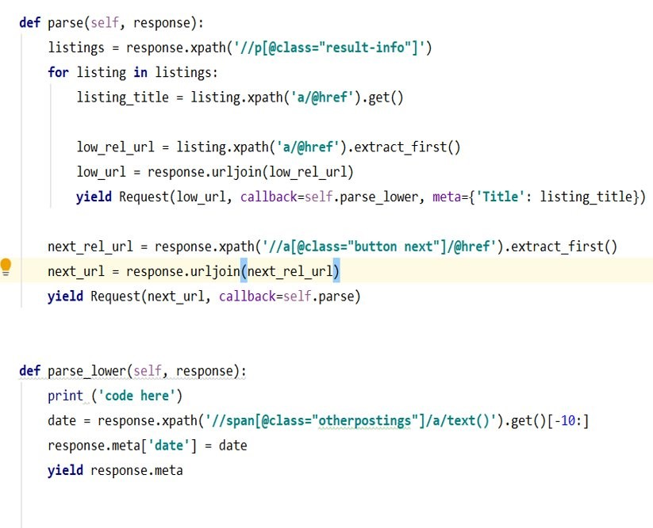
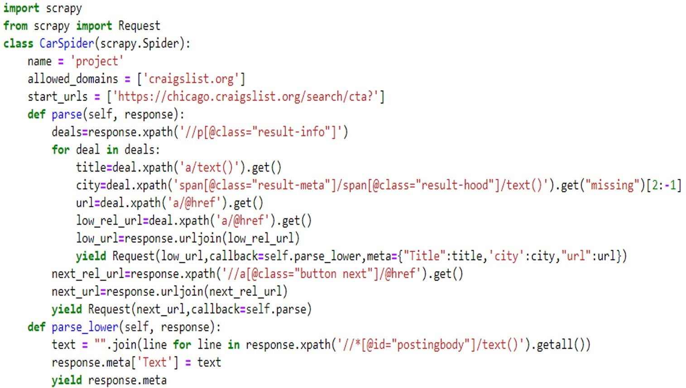
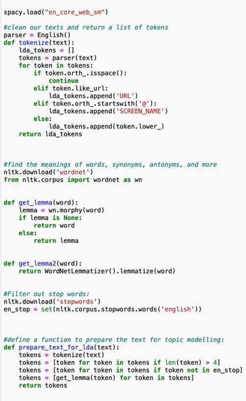
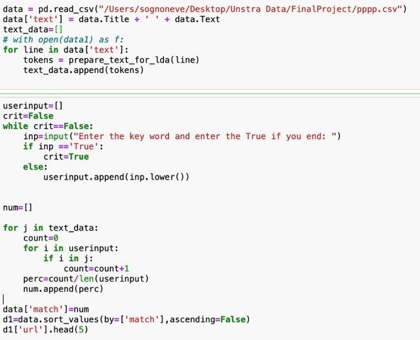
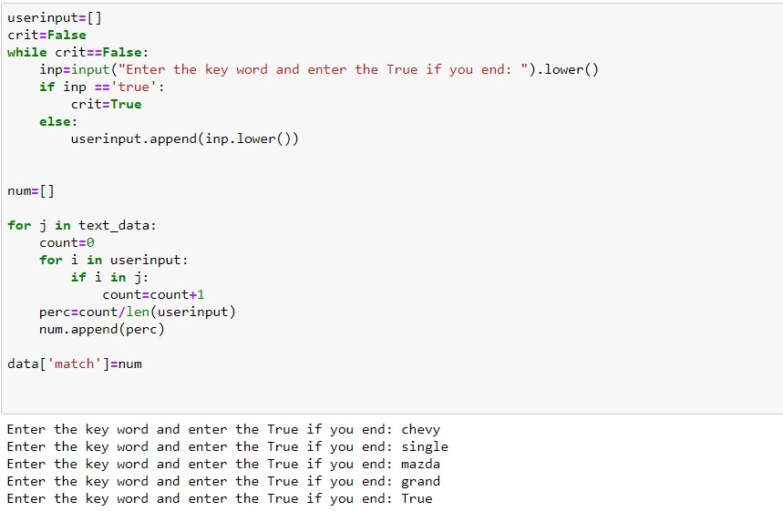
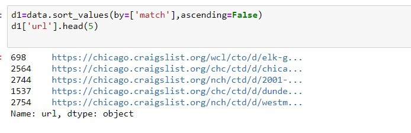

# Analyzing-Unstructured-Data-Project

>Developed analytical solutions to improve Craigslist’s online platform using the techniques of text mining, classification, and NLP

## Data Analysis

>Our raw data came from proprietary scrappers that we developed for the inactive listings identifier, expired events identifier, misclassified ads, and the lean search system. The scrappers yielded CSV files that contain raw text, including symbols, numeric, and other characters.

### Identifying Old, Inactive Listings, and Expired Events

> For expired events listings and inactive listings identifier, we extracted the information listing’s title and posted date with predefined categories and region. The solution is based on a flagging algorithm where takes in a specified parameter in the form of date and creates flags based on that parameter. Since there is no modelling involved, there was negligible data pre-processing required. Based on a trial run, we came up with the following results for car deals listed in Philadelphia for 7-day filter criteria:

>

#### Expired Listings Scrapper 

>

#### Expired Listings Flagger

>

#### Inactive listings Scrapper

>

#### Inactive Listings Flagger

>

### Lean Product Search System

>For our Lean Search System, we followed a similar workflow, whereby we started off with a scrapper that collects raw data. We then performed normalization in the form of tokenization, lemmatization, and removal of stop words. We then created an algorithm that performs topic modeling that takes in the user’s search term as an input. The model then generates keywords from the search and fetches a list of top 5 listings based on an assigned weight to similar ads based on pre-determined keywords.

>Our solution improves on Craigslist’s traditional search system that is usually text-based to our solution that is keyword-based, where instead of searching from sentence to sentence, we search on word for word basis. This system is beneficial since the search criteria are much smaller this way, we can expect to reduce computational workload, hence the name Lean Search System.

>We performed a trial run on a dataset of ~3000 vehicle deals, based on 5 specific keywords and the tool generated five closest URLs related to the keywords

#### Lean Product Search System Scrapper

>

#### Lean Product Search System Code

>

>

#### Output based on Lean Product Search System Code

>

>

### Resolving Misclassified Advertisements

>Out of these 6 models we trained do identify misclassified ads, we learned that that SVM is the best performing model. For this use, SVM yielded a test-set accuracy of 83.33%, giving it a marginally better performance than a simple Logit model with 82.27% test-set accuracy and a sophisticated Deep Neural Network with 4 hidden layers that yielded 82.62% test-set accuracy.

>Bearing in mind the cost-performance trade-off, SVM is a perfect solution for Craigslist’s problem, given its computationally savvy nature. This means that the improved users experience that may come from this. 

## Validation
  #### *Identifying Old, Inactive Listings, and Expired Events*
  
  >Given the static nature and non-predictive nature of our expired and inactive listings solution, there is no quantifiable accuracy measure that we can use the asses the accuracy of the answers since it is deterministic and the result (i.e., the flag) will be 100% accurate given the parameters.
  
  #### *Lean Product Search System*
  
  >Similar to the two identifiers, the Lean Search System has no quantitative accuracy measure to measure our model’s performance against since the output of this solution is subjective in nature.  In the future, assessment of this solution can be done via comparison of trade volume before and after the use of our feature or through measure of traffic retention, whether a visitor stay in the website for longer ones we have Lean Search System enabled in the site or we can also conduct  A/B testing to gain some observational data on buyer’s behavior with and without the Lean Search System
  
 
  #### *Resolving Misclassified Advertisements* 
  
  >Out of these 6 models we trained do identify misclassified ads, we learned that that SVM is the best performing model. For this use, SVM yielded a test-set accuracy of 83.33%, giving it a marginally better performance than a simple Logit model with 82.27% test-set accuracy and a sophisticated Deep Neural Network with 4 hidden layers that yielded 82.62% test-set accuracy.
  
  >Bearing in mind the cost-performance trade-off, SVM is a perfect solution for Craigslist’s problem, given its computationally savvy nature. This means that the improved users experience that may come from this

